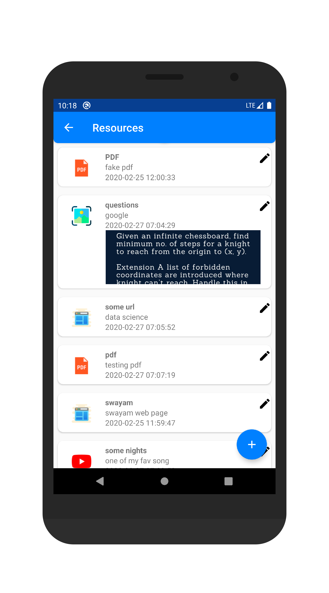
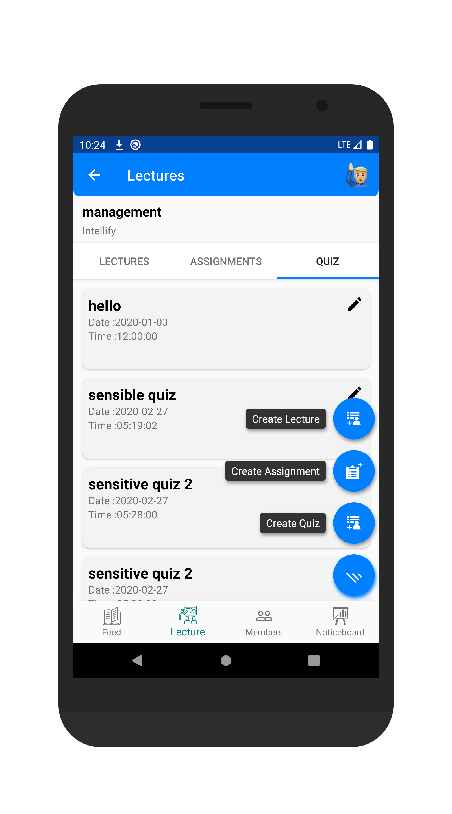

# Intellify Internship Documented
Report of my work at intellify
Responsibilities as an android developer were following:
Making screen UI for the android app
Write clean and maintainable code for other developers

# Libraries and Technical Features
1. Has used retrofit library for Network
2. Clean architecture with MVVM architecture and best practices implemented
3. Clean and maintainable codebase

# Screenshots
<h1>Home </h1>

<h1>Navbar and Study Material </h1>

 
<h1>View Lectures and See Members</h1>

 
<h1>Create Noticeboard and Lecture Details</h1>

 
<h1>Take attendance and Upload Resource</h1>

 
<h1>View Resource and Comment on Resources</h1>

 

 

 

## Credits
Intellify team

