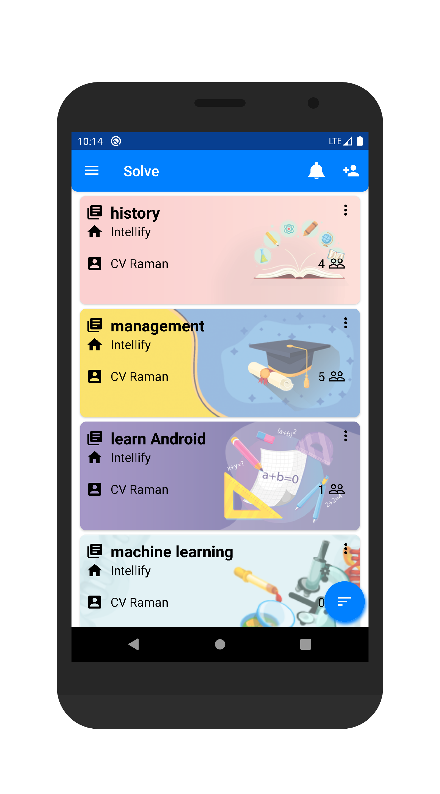
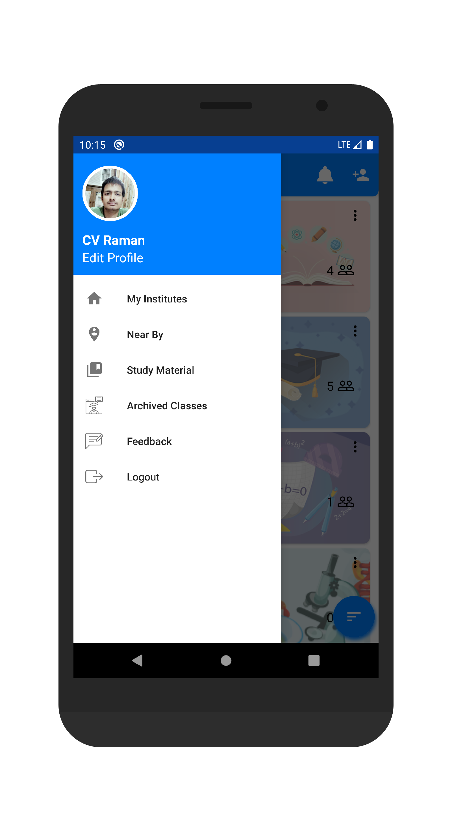
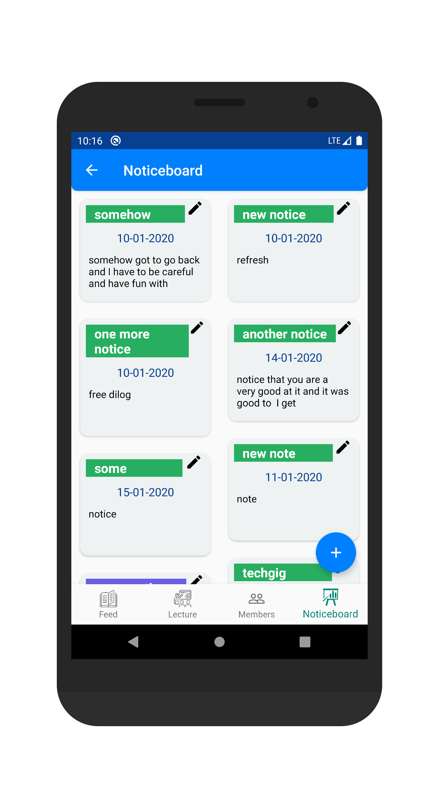
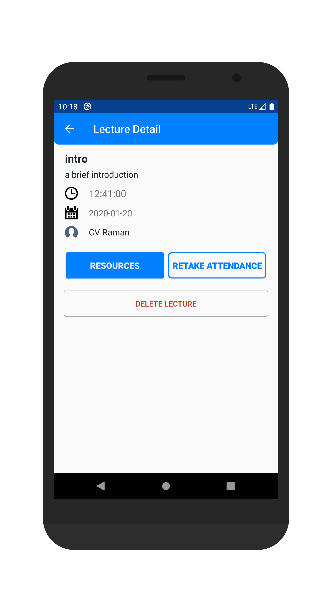
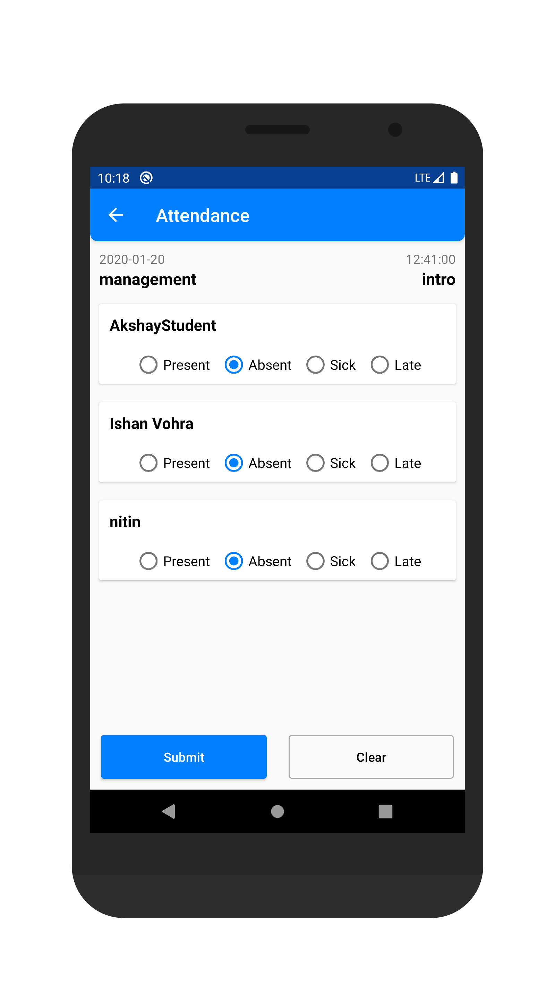
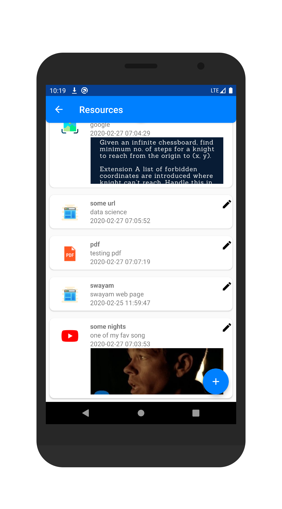
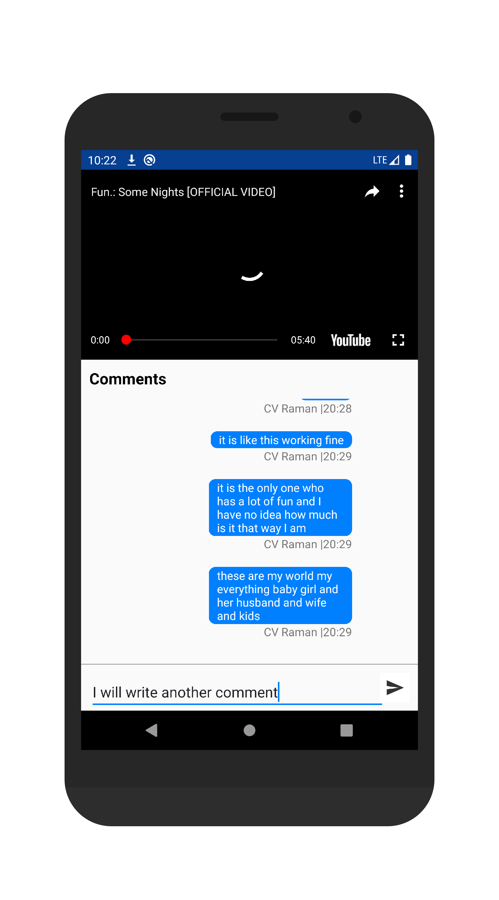

# Intellify Internship Documented
Report of my work at intellify
Responsibilities as an android developer were following:
Making screen UI for the android app
Write clean and maintainable code for other developers

# Technical Features
1. Room database implemented so that application can work without internet
2. Clean architecture with MVVM architecture and best practices implemented
3. Clean and asthetic appealing UI
4. Share your memes on social platforms
5. Dynamic UI and theme changes, like status and app bar color changes as per day, or even with the contents viewed, or per 30 minutes
6. Save your memes in local storage
7. Scroll unlimited to get more and more memes
8. Optimal Caching usage 

# Screenshots
<h1>Home </h1>

 
<h1>something</h1>

 
<h1>something</h1>

 
<h1>something</h1>

 
<h1>something</h1>

 
<h1>something</h1>

 
<h1>something</h1>

 
<h1>something</h1>

## Credits
something

## Database debugging

## Issues

